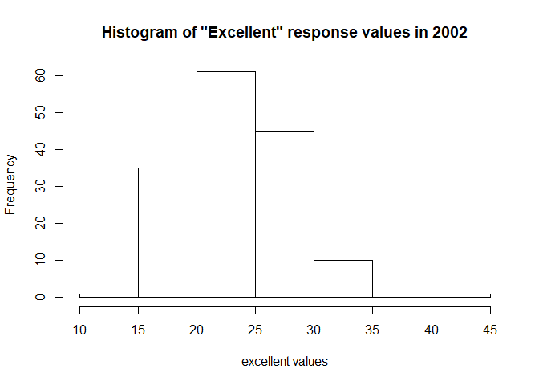

P8105 HW2
================
Abhishek Ajay (aa4266)
October 1, 2018

Problem 1
=========

Data import and manipulation
----------------------------

``` r
nyc_transit_data = 
  read_csv("./datasets/NYC_Transit_Subway_Entrance_And_Exit_Data.csv") %>%
  janitor::clean_names() %>%
  select(line:entry, vending, ada) %>%
  mutate(entry = recode(entry, "YES" = TRUE, "NO" = FALSE))
```

    ## Parsed with column specification:
    ## cols(
    ##   .default = col_character(),
    ##   `Station Latitude` = col_double(),
    ##   `Station Longitude` = col_double(),
    ##   Route8 = col_integer(),
    ##   Route9 = col_integer(),
    ##   Route10 = col_integer(),
    ##   Route11 = col_integer(),
    ##   ADA = col_logical(),
    ##   `Free Crossover` = col_logical(),
    ##   `Entrance Latitude` = col_double(),
    ##   `Entrance Longitude` = col_double()
    ## )

    ## See spec(...) for full column specifications.

Further Questions
-----------------

### Question 1

How many distinct stations are there?

``` r
#count(distinct(nyc_transit_data, line, station_name))
distinct(nyc_transit_data, line, station_name) %>%
  count() %>%
  knitr::kable()
```

|    n|
|----:|
|  465|

### Question 2

How many stations are ADA compliant?

``` r
nyc_transit_data %>%
  filter(ada == TRUE) %>%
  distinct(line, station_name) %>%
  count() %>%
  knitr::kable()
```

|    n|
|----:|
|   84|

### Question 3

What proportion of station entrances / exits without vending allow entrance?

``` r
nyc_transit_data %>%
  filter(vending == "NO", entry == TRUE) %>%
  count()/nrow(nyc_transit_data[which(nyc_transit_data$vending == "NO"),]) 
```

    ##           n
    ## 1 0.3770492

Reformating of the data
-----------------------

Here we reformat the data such the route number and the route name are distinct variables.

``` r
nyc_transit_data_reformatting =
  nyc_transit_data %>%
  gather(key = route_number, value = route_name, route1:route11) %>%
  separate(route_number, into = c("route_str", "route_number"), sep = 5) %>%
  select(-route_str)
  #filter(distinct(route_number, route_name))
```

Further questions on the reformatted table
------------------------------------------

### Question 1

How many distinct stations serve the A train?

``` r
nyc_transit_data_reformatting %>%
  filter(route_name == "A") %>%
  distinct(line, station_name) %>%
  count() %>%
  knitr::kable()
```

|    n|
|----:|
|   60|

### Question 2

Of the stations that serve the A train, how many are ADA compliant?

``` r
nyc_transit_data_reformatting %>%
  filter(route_name == "A", ada == TRUE) %>%
  distinct(line, station_name) %>%
  count() %>%
  knitr::kable()
```

|    n|
|----:|
|   17|

Problem 2
=========

Import and manipulation of the Mr. Trash Wheel Dataset.

``` r
mr_trash_wheel_data =
  read_excel("./datasets/HealthyHarborWaterWheelTotals2017-9-26.xlsx", range = "A2:O258") %>%
  janitor::clean_names() %>%
  filter(is.na(x_1)) %>%
  select(-x_1) %>%
  filter(!is.na(dumpster)) %>%
  mutate(sports_balls = as.integer(round(sports_balls)))
```

Import and manipulation of the precipitation data from 2016 and 2017

``` r
mr_trash_wheel_precip_data_2016 =
  read_excel("./datasets/HealthyHarborWaterWheelTotals2017-9-26.xlsx", sheet = 4, range = "A2:B15") %>% 
  janitor::clean_names() %>%
  filter(!is.na(total)) %>%
  select(month, total_precipitation = total)

mr_trash_wheel_precip_data_2016$year = 2016

mr_trash_wheel_precip_data_2017 =
  read_excel("./datasets/HealthyHarborWaterWheelTotals2017-9-26.xlsx", sheet = 3, range = "A2:B15") %>% 
  janitor::clean_names() %>%
  filter(!is.na(total)) %>%
  select(month, total_precipitation = total)

mr_trash_wheel_precip_data_2017$year = 2017
```

Combining the the precipitation data tables fromm both 2016 and 2017.

``` r
mr_trash_wheel_precip_data_2016_2017 =
  left_join(mr_trash_wheel_precip_data_2016, mr_trash_wheel_precip_data_2017, by = 'month') %>%
  mutate(month = month.name[month])
```

Write some stuff abotu problem 2
--------------------------------

Problem 3
=========

Here we use the BRFSS data set from the P8105.datasets package and format it.

``` r
#View(p8105.datasets::brfss_smart2010)

brfss_dataset =
  p8105.datasets::brfss_smart2010 %>%
  janitor::clean_names() %>% 
  rename(resp_id = respid, location_abbreviation = locationabbr, location_desc = locationdesc) %>% 
  filter(topic == "Overall Health") %>% 
  select(-c(class:question), -sample_size, -c(confidence_limit_low:geo_location)) %>% 
  spread(key = response, value = data_value) %>% 
  janitor::clean_names() %>% 
  mutate(excellent_or_very_good = excellent + very_good)
```

Further questions on brfss\_dataset
-----------------------------------

### Question 1

How many unique locations are included in the dataset? Is every state represented? What state is observed the most?

``` r
brfss_dataset %>%
  distinct(location_abbreviation) %>% 
  count()
```

    ## # A tibble: 1 x 1
    ##       n
    ##   <int>
    ## 1    51

All 50 states and 1 US Territory, the District of Columbia are represented in the Table.

``` r
#table(brfss_dataset$location_abbreviation) %>%
 # which.max()
most_obsv_state = 
  table(brfss_dataset$location_abbreviation) %>%
  sort() %>% 
  names() %>% 
  tail(1)
```

The most observed state in the table is NJ.

``` r
excellent_2002 =
  brfss_dataset %>% 
  filter(year == 2002) %>%
  select(excellent) 
```

### Question 2

In 2002, what is the median of the “Excellent” response value? The median of the "Excellent" response value in 2002 is 23.6.

### Question 3

Make a histogram of “Excellent” response values in the year 2002.

``` r
hist(excellent_2002$excellent, main = "Histogram of \"Excellent\" response values in 2002", xlab = "excellent values" )
```


