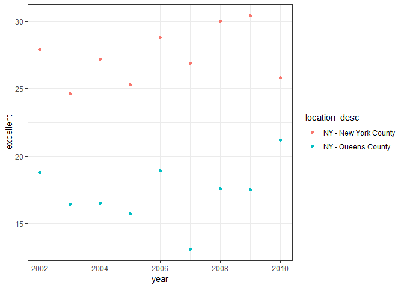

P8105 HW2
================
Abhishek Ajay (aa4266)
October 1, 2018

Problem 1
=========

Data import and manipulation
----------------------------

``` r
nyc_transit_data = 
  read_csv("./datasets/NYC_Transit_Subway_Entrance_And_Exit_Data.csv") %>%
  janitor::clean_names() %>%
  select(line:entry, vending, ada) %>%
  mutate(entry = recode(entry, "YES" = TRUE, "NO" = FALSE)) #as.logical on character gives error
```

    ## Parsed with column specification:
    ## cols(
    ##   .default = col_character(),
    ##   `Station Latitude` = col_double(),
    ##   `Station Longitude` = col_double(),
    ##   Route8 = col_integer(),
    ##   Route9 = col_integer(),
    ##   Route10 = col_integer(),
    ##   Route11 = col_integer(),
    ##   ADA = col_logical(),
    ##   `Free Crossover` = col_logical(),
    ##   `Entrance Latitude` = col_double(),
    ##   `Entrance Longitude` = col_double()
    ## )

    ## See spec(...) for full column specifications.

The dataset at hand contains information related to *each* entrance and exit for *each* subway station in New York City.

The variables in the original dataset are

| Variables                            | Variables                                             |
|:-------------------------------------|:------------------------------------------------------|
| Division                             | Staffing scenario (NONE, FULL, PART)                  |
| Line                                 | Staff hours, ADA Complaince                           |
| Station Name                         | Some notes regarding ADA                              |
| Station Latitute and Longitude       | Availability of Free Crossover                        |
| Route names of Route numbers 1 to 11 | The station's North South Street and East West Street |
| Each station's Entrace Type          | The station's Corner                                  |
| Whether they have an entry or not    | Entrance Latitude and Longitude                       |
| Whether they're Exit only or not     | Station Location                                      |
| Whether they have Vending            | Entrance Location.                                    |

The data has been imported and cleaned by cleaning the column names into a standard, common format (underscore). Then a selection of specific columns from line to entry and vending and ADA compliance data, that are relevant for further analysis. The cell data of the entry column has been converted from character YES/NO into logical TRUE and FALSE.

The dimensions of the new table is

|  Rows|  Columns|
|-----:|--------:|
|  1868|       19|

No, the data isn't tidy. The columns are redundant with columns for each route number.

Further Questions on this data:
-------------------------------

### Question 1

How many distinct stations are there?

There are 465

### Question 2

How many stations are ADA compliant?

``` r
#Looking at the distinct stations that are ADA complaint
print(
  paste(
    "There are",
    nyc_transit_data %>% 
      filter(ada == TRUE) %>% 
      distinct(line, station_name) %>% 
      count(),
    "distinct stations that are ADA complaint"
  )
)
```

    ## [1] "There are 84 distinct stations that are ADA complaint"

### Question 3

What proportion of station entrances / exits without vending allow entrance?

``` r
print(
  paste(
    "The proportion of stations entrances/exits without vending that allow entrance are",
    nyc_transit_data %>%
      filter(vending == "NO", entry == TRUE) %>% #filter using two conditions that are satisfied together
      count()/nrow(nyc_transit_data[which(nyc_transit_data$vending == "NO"),])
  )
) 
```

    ## [1] "The proportion of stations entrances/exits without vending that allow entrance are 0.377049180327869"

Since our dataset contains information related to *each* entrance and exit for *each* subway station in New York City, we don't need to take distinct stations to calculate the above proportion.

### Reformatting of the data

Here we reformat the data such the route number and the route name are distinct variables.

``` r
nyc_transit_data_reformatting =
  nyc_transit_data %>%
  gather(key = route_number, value = route_name, route1:route11) %>% #bringing all route number columns together
  separate(route_number, into = c("route_str", "route_number"), sep = 5) %>% #separating the route number content into two separate columns
  select(-route_str) #dropping the column with just "route" written in its every cell
```

Upon reformatting the NYC transit data, we got a new table with dimensions :

|   Rows|  Columns|
|------:|--------:|
|  20548|       10|

.

Further questions on the reformatted table
------------------------------------------

### Question 1

How many distinct stations serve the A train?

``` r
print(
  paste(
    "The number of distinct stations serving the A train:",
    nyc_transit_data_reformatting %>%
      filter(route_name == "A") %>%
      distinct(line, station_name) %>%
      count()
  )
) 
```

    ## [1] "The number of distinct stations serving the A train: 60"

### Question 2

Of the stations that serve the A train, how many are ADA compliant?

``` r
print(paste(
  "ADA complaint stations that serve the A train:",
  nyc_transit_data_reformatting %>%
    filter(route_name == "A", ada == TRUE) %>%
    distinct(line, station_name) %>%
    count()
  )
)
```

    ## [1] "ADA complaint stations that serve the A train: 17"

Problem 2
=========

The import and manipulation of the Mr. Trash Wheel Dataset.

``` r
mr_trash_wheel_data =
  read_excel("./datasets/HealthyHarborWaterWheelTotals2018-7-28.xlsx", range = "A2:N338") %>%
  janitor::clean_names() %>%
  filter(!is.na(dumpster)) %>%
  mutate(sports_balls = as.integer(round(sports_balls))) %>% 
  rename("weight" = weight_tons, "volume" = volume_cubic_yards) #renaming columns to more reasonable variable names
```

The columns weight\_tons and volume\_cubic\_yards were renamed to weight and volume since mentioning units seems superfluous. It can be mentioned once in the data description to suffice for it.

Import and manipulation of the precipitation data from 2016 and 2017

``` r
trash_wheel_precip_data_2016 =
  read_excel("./datasets/HealthyHarborWaterWheelTotals2018-7-28.xlsx", sheet = 5, range = "A2:B15") %>% 
  janitor::clean_names() %>%
  filter(!is.na(total)) %>%   #omit rows without precipitation data
  select(month, total_precipitation = total)

trash_wheel_precip_data_2016$year = 2016 #Adding variable year


trash_wheel_precip_data_2017 =
  read_excel("./datasets/HealthyHarborWaterWheelTotals2018-7-28.xlsx", sheet = 4, range = "A2:B15") %>% 
  janitor::clean_names() %>%
  filter(!is.na(total)) %>%   #omit rows without precipitation data
  select(month, total_precipitation = total)

trash_wheel_precip_data_2017$year = 2017 #Adding variable year
```

Combining the the precipitation data tables fromm both 2016 and 2017.

``` r
trash_wheel_precip_data_2016_2017 =
  left_join(trash_wheel_precip_data_2016, trash_wheel_precip_data_2017, by = 'month') %>% 
  mutate(month = month.name[month])

trash_wheel_precip_data_2016_2017$month[13] = "Grand Total"
```

Left join was used since there are no missing values in either of the two tables and any join (constructive) will give a similar output.

Data Description
----------------

The data used here is from the *Mr. Trash Wheel* dataset taken from the course website, P8105.com which is in the excel format. However, it is openly available on Baltimore Waterfront website under the *Trash Wheel Project*. The project was initiated in 2014. The weight is in *tons* and the volume is in *cubic yards*.

We get the precipitaion data for years 2016 and 2017 from sheets 5 and 4 of the excel file respectively. We added an extra variable to both the tables for the year. The dimensions of both the datasets are

|  Rows|  Colunmns|
|-----:|---------:|
|    13|         3|

and the combined table with total precipitation from 2016 and 2017 is

|  Rows|  Columns|
|-----:|--------:|
|    13|        5|

.

Number of observations for each year 2016 and 2017 precipitation dataset is 12.

Number of observations that are dumper sepcific in the Mr. Trash Wheel dtata set is 285.

Total homes powered since May 2014 up till July 2018 is 1.195110^{4}.

It is observed that among those rows which had no comments, the most accummulated trash is 1.0289610^{7}

Total precipitation in 2017 is 32.93

Median of the number of sports balls in a dumpster in 2016 is 26

Using the points mentioned on <http://korbedpsych.com/R02Variables.html>:

-   Key variables for the Mr. Trash Wheel sheet of the Mr. Trash Wheel dataset are:

    -   date

    -   weight

    -   volume

    -   homes\_powered

-   Key Variables for the combined precipitation dataset for 2016 and 2017 are:

    -   month

    -   total\_precipitation

    -   year

Problem 3
=========

Here we use the BRFSS data set from the P8105.datasets package and format it.

``` r
brfss_dataset =
  p8105.datasets::brfss_smart2010 %>% #loading the data from the package
  janitor::clean_names() %>% 
  rename(resp_id = respid, location_abbreviation = locationabbr, location_desc = locationdesc) %>% #further manual renaming to appropriate variable names
  filter(topic == "Overall Health") %>% 
  select(-c(class:question), -sample_size, -c(confidence_limit_low:geo_location)) %>% 
  spread(key = response, value = data_value) %>%  #restructuring the dataset
  janitor::clean_names() %>% 
  mutate(excellent_or_very_good = excellent + very_good)
```

Questions on the cleaned and restructured BRFSS dataset
-------------------------------------------------------

### Question 1

How many unique locations are included in the dataset? Is every state represented? What state is observed the most?

``` r
#Used the cat function to use the line break since it doesn't work with print function
cat(
  paste(
    "Number of unique locations included in the dataset:",
    brfss_dataset %>% 
      distinct(location_desc) %>% 
      count(),
    "\n\nNumber of states represented in the dataset:",
    brfss_dataset %>% 
      distinct(location_abbreviation) %>% 
      count(),
    "\n\nAll 50 states and 1 US Territory, the District of Columbia, are represent in the dataset table"
  )
)
```

    ## Number of unique locations included in the dataset: 404 
    ## 
    ## Number of states represented in the dataset: 51 
    ## 
    ## All 50 states and 1 US Territory, the District of Columbia, are represent in the dataset table

``` r
print(
  paste(
    "The most observed state in the table is:",
    brfss_dataset %>% 
      select(location_abbreviation) %>% 
      table() %>% 
      sort() %>% #default is ascending, last is highest/biggest
      names() %>% 
      tail(1) #1 is put in as a parameter to choose the last entry of the tail
  )
)
```

    ## [1] "The most observed state in the table is: NJ"

``` r
#Creating a variable to be used in the follwing two questions
excellent_2002 =
  brfss_dataset %>% 
  filter(year == 2002) %>%
  select(excellent) 
```

### Question 2

In 2002, what is the median of the “Excellent” response value?

The median of the "Excellent" response value in 2002 is 23.6.

### Question 3

Make a histogram of “Excellent” response values in the year 2002.

Histogram

``` r
hist(excellent_2002$excellent, main = "Histogram of \"Excellent\" response values in 2002", xlab = "excellent values" )
```


### Question 4

Make a scatterplot showing the proportion of “Excellent” response values in New York County and Queens County (both in NY State) in each year from 2002 to 2010.

Scatterplot

``` r
brfss_dataset %>% 
  filter(location_desc == "NY - New York County" | location_desc == "NY - Queens County") %>%
  ggplot(aes(x = year, y = excellent )) + geom_point(aes(color = location_desc)) + theme_bw()
```


